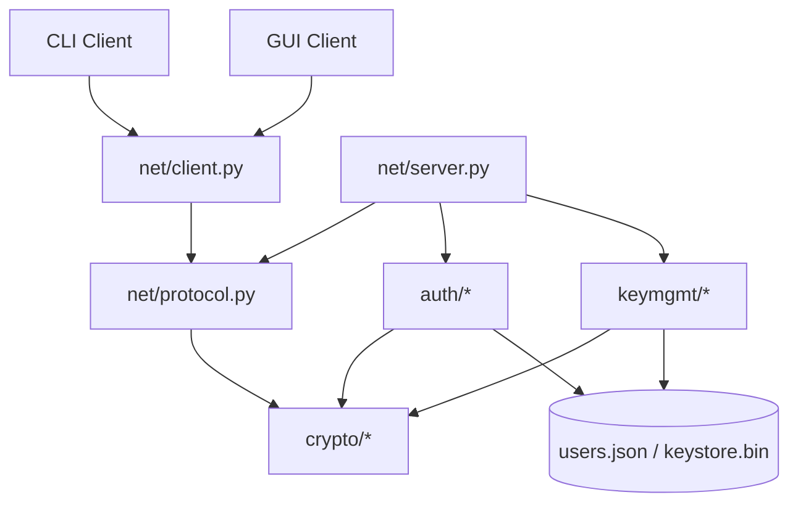
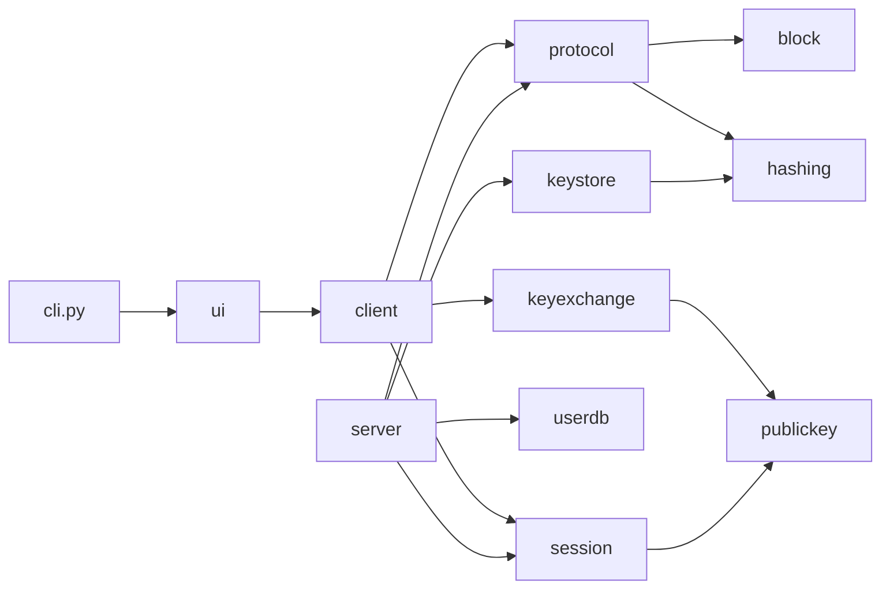
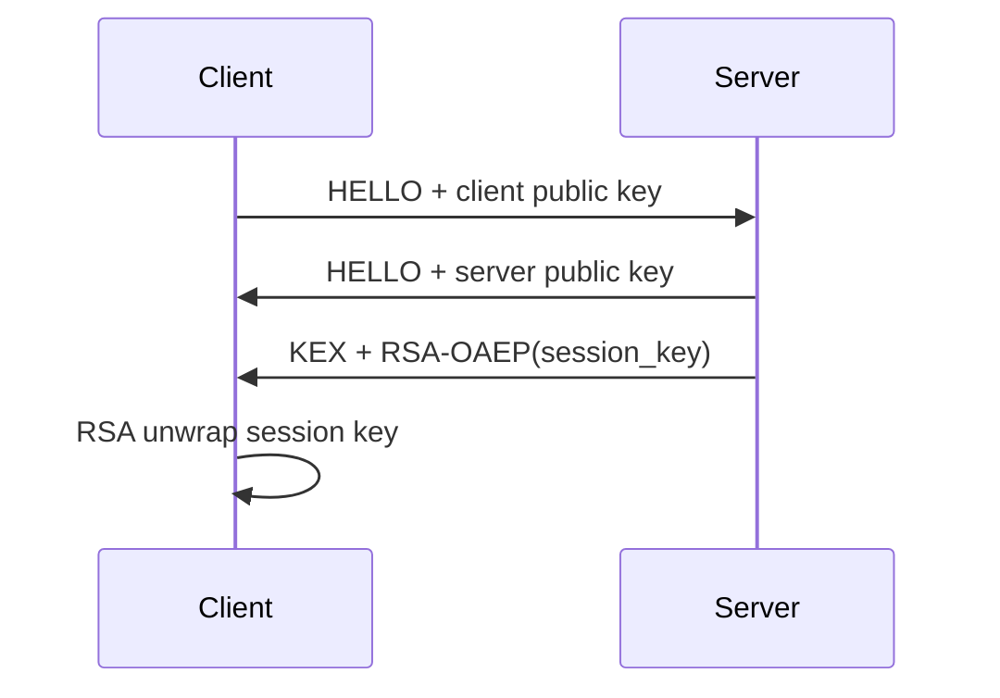
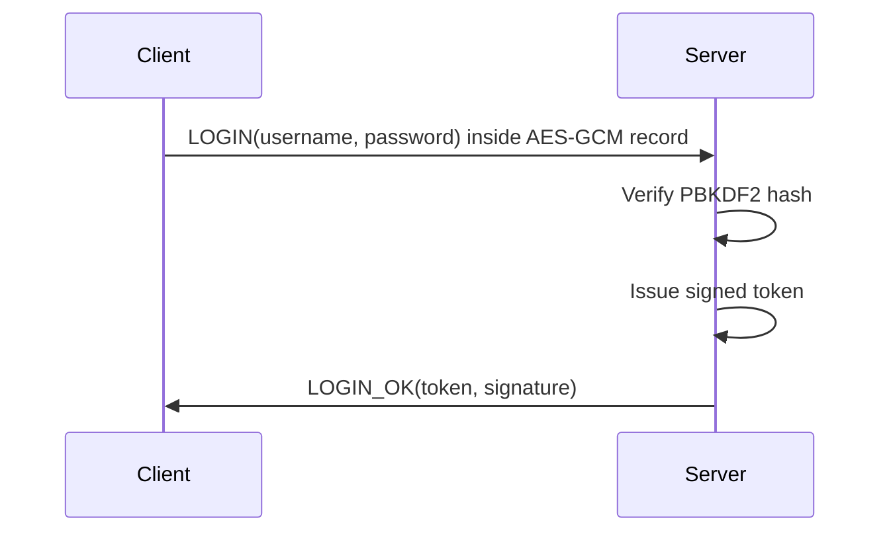
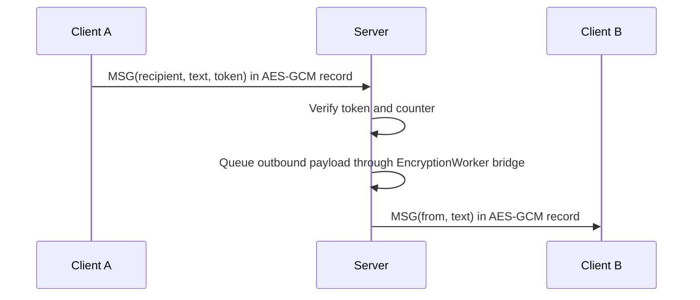

# Design Document

## 1. Architecture Summary

The Secure Communication Suite uses layered design:

- `crypto/` provides AES, RSA, and hashing primitives.
- `keymgmt/` protects key material at rest and supports session-key wrapping.
- `auth/` manages user credentials and signed session tokens.
- `net/` implements framing, encrypted records, and client/server messaging.
- `ui/` exposes CLI and Tkinter front ends through the same client core.

## 2. High-Level Architecture



## 3. Module Responsibilities

### 3.1 `secure_suite/crypto/block_cipher.py`

- Provides AES-256-GCM encryption and decryption for transport and storage.
- Provides AES-CBC as a teaching-only comparison mode for documentation.
- Preserves the assignment’s required `EncryptionWorker` thread class.
- Supplies a bridge that lets the server’s outbound queue exercise the required worker.

### 3.2 `secure_suite/crypto/public_key.py`

- Generates RSA-2048 key pairs.
- Encrypts AES session keys with RSA-OAEP.
- Signs and verifies messages or tokens with RSA-PSS.

### 3.3 `secure_suite/crypto/hashing.py`

- Computes SHA-256 digests for bytes and files.
- Derives keys and password hashes with PBKDF2-HMAC-SHA256.
- Computes HMAC-SHA256 for integrity checks where needed.

### 3.4 `secure_suite/keymgmt/keystore.py`

- Encrypts private keys and application secrets into an AES-GCM protected JSON file.
- Uses PBKDF2-HMAC-SHA256 to derive the master encryption key from a passphrase.

### 3.5 `secure_suite/keymgmt/keyexchange.py`

- Wraps and unwraps 32-byte AES session keys using RSA-OAEP.

### 3.6 `secure_suite/auth/user_db.py`

- Registers users with per-user salts and PBKDF2-derived password hashes.
- Verifies passwords with constant-time comparison.
- Stores each user’s public key for secure communication.

### 3.7 `secure_suite/auth/session.py`

- Issues signed session tokens after successful login.
- Verifies token signature, expiry, and structure.

### 3.8 `secure_suite/net/protocol.py`

- Encodes and decodes framed messages over TCP.
- Builds authenticated AES-GCM records using message counters in AAD.
- Enforces record freshness through replay detection.

### 3.9 `secure_suite/net/server.py`

- Accepts multiple concurrent clients.
- Performs handshake, registration, login, and message routing.
- Uses the required `EncryptionWorker` bridge on the outbound queue before final record protection.

### 3.10 `secure_suite/net/client.py`

- Handles handshake, authentication, sending, receiving, and polling.
- Serves as the shared protocol core for both UI variants.

## 4. Dependency View



## 5. Data Formats

### 5.1 Keystore File

The keystore file is JSON with these top-level fields:

```json
{
  "salt": "hex",
  "nonce": "hex",
  "tag": "hex",
  "ciphertext": "hex"
}
```

The decrypted payload is a JSON object containing named records such as RSA key pairs and
other private application state.

### 5.2 User Database

```json
{
  "alice": {
    "salt_hex": "hex",
    "pbkdf2_hex": "hex",
    "iters": 200000,
    "rsa_pub_pem": "-----BEGIN PUBLIC KEY-----..."
  }
}
```

### 5.3 Session Token

The signed session token payload is JSON:

```json
{
  "user": "alice",
  "exp": 1777777777,
  "nonce": "hex"
}
```

The server transmits the token as payload bytes plus an RSA-PSS signature.

### 5.4 Wire Record

After handshake, each protected record is sent as:

```text
4-byte length || 1-byte version || 1-byte type || 8-byte counter || 12-byte nonce || ciphertext || 16-byte tag
```

The AAD for AES-GCM binds the version, type, and counter so replay or tampering is rejected.

## 6. Sequence Diagrams

### 6.1 Handshake



### 6.2 Login



### 6.3 Send Message



## 7. Threat Model

### 7.1 Assets

- User passwords
- User and server private keys
- Session keys
- Messages in transit
- Session tokens

### 7.2 Adversary Assumptions

- The attacker can observe or tamper with network traffic.
- The attacker can read files from disk if storage is not encrypted.
- The attacker cannot break AES-256, RSA-2048, or SHA-256 directly.

### 7.3 Security Controls

- AES-256-GCM protects confidentiality and integrity of records and stored blobs.
- RSA-OAEP protects session-key distribution.
- RSA-PSS protects token authenticity.
- PBKDF2-HMAC-SHA256 slows password guessing.
- Replay counters prevent duplicate protected records from being accepted.

## 8. Phase 1 Answers

### 8.1 What are the key components of the Secure Communication Suite?

The key components are the block cipher module, public-key module, hashing module, key
management module, authentication module, and the internet-services security module formed
by the client/server application.

### 8.2 What cryptographic techniques will be used in the project?

The design uses AES-256-GCM, RSA-2048 OAEP, RSA-2048 PSS, SHA-256, HMAC-SHA256, and
PBKDF2-HMAC-SHA256 with at least 200,000 iterations.

### 8.3 What are the main functions of each module in the suite?

- `block_cipher.py`: encrypt and decrypt protected records.
- `public_key.py`: generate keys, wrap session keys, sign tokens.
- `hashing.py`: hash data and support key derivation.
- `keystore.py`: protect secret material on disk.
- `user_db.py` and `session.py`: verify identities and authorize sessions.
- `protocol.py`, `server.py`, and `client.py`: integrate all modules into the secure service.
