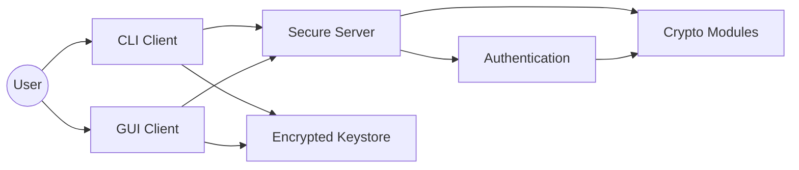

# Software Requirements Specification

## 1. Purpose

The Secure Communication Suite is a Python application that demonstrates how modern
cryptographic modules can be combined to protect data in transit and at rest. It
implements symmetric encryption, public-key cryptography, hashing, key management,
authentication, and a secured internet-service workflow.

## 2. Scope

The project delivers:

- A cryptographic core built with AES-256-GCM, RSA-2048, SHA-256, and PBKDF2-HMAC-SHA256
- A secure keystore for local key protection
- Password-based authentication with signed session tokens
- A TCP client/server messaging service secured by the project’s cryptographic modules
- Two user interfaces that share one client protocol core: CLI and Tkinter GUI

## 3. Definitions

- `AAD`: Additional authenticated data bound to an AEAD ciphertext.
- `AEAD`: Authenticated encryption with associated data.
- `GCM`: Galois/Counter Mode for authenticated AES encryption.
- `OAEP`: Optimal Asymmetric Encryption Padding for RSA encryption.
- `PSS`: Probabilistic Signature Scheme for RSA signatures.
- `PBKDF2`: Password-Based Key Derivation Function 2.
- `Session token`: A server-issued signed object proving authenticated session state.

## 4. Stakeholders

- Student developers implementing the suite
- Course graders evaluating correctness, security, and documentation
- End users demonstrating secure message exchange

## 5. System Overview

The system is a small secure messaging suite. Clients connect to a TCP server, establish a
session key using RSA, authenticate with password-based login, and exchange messages over
an AES-256-GCM protected record layer. User credentials and private keys are never stored
in plaintext.

## 6. Functional Requirements

### 6.1 User Story Mapping

| ID | User Story | Functional Requirement |
|---|---|---|
| FR-1 | Encrypt messages using a block cipher | The system shall encrypt application messages with AES-256-GCM before transmission. |
| FR-2 | Share keys securely with a communication partner | The system shall distribute AES session keys using RSA-2048 OAEP. |
| FR-3 | Verify integrity of received messages | The system shall authenticate messages with AES-GCM tags and SHA-256 based signatures/HMACs where required. |
| FR-4 | Manage cryptographic keys securely | The system shall store private keys in an encrypted keystore protected by PBKDF2-derived AES keys. |
| FR-5 | Authenticate securely | The system shall register users with PBKDF2-HMAC-SHA256 password hashes and issue RSA-PSS signed session tokens. |
| FR-6 | Secure internet services | The system shall provide a TCP messaging service where no application plaintext is exposed on the wire. |

### 6.2 Detailed Requirements

#### Block Cipher Module

- The module shall support AES keys of 128, 192, and 256 bits.
- The production transport path shall use AES-256-GCM.
- The module shall expose encrypt and decrypt helpers for AES-GCM.
- The module shall include the assignment’s required `EncryptionWorker` thread skeleton.

#### Public-Key Module

- The module shall generate RSA-2048 key pairs.
- The module shall encrypt short secrets with RSA-OAEP using SHA-256.
- The module shall sign and verify messages with RSA-PSS using SHA-256.

#### Hashing Module

- The module shall hash byte strings with SHA-256.
- The module shall hash files incrementally to support large inputs.
- The module shall compute HMAC-SHA256 digests.

#### Key Management Module

- The keystore shall encrypt all stored material on disk with AES-GCM.
- The keystore master key shall be derived by PBKDF2-HMAC-SHA256 with at least 200,000 iterations.
- The module shall support secure loading, saving, insertion, and retrieval of key records.

#### Authentication Module

- The module shall support user registration.
- The module shall store per-user salts and PBKDF2-derived password hashes.
- The server shall issue signed session tokens on successful login.
- The server shall verify token signature and expiry before authorizing requests.

#### Internet Services Security Module

- The system shall use TCP sockets with length-prefixed framing.
- The system shall encrypt application records after key exchange.
- The system shall reject replayed counters and tampered records.
- The system shall support both CLI and GUI clients through a shared client core.

## 7. Non-Functional Requirements

### 7.1 Security

- Confidentiality: plaintext shall not appear on the network after session establishment.
- Integrity: tampering shall be detected through AEAD tags and digital signatures.
- Authentication: access shall require password verification and server-issued token validation.
- Secure storage: private keys and server secrets shall be stored encrypted at rest.

### 7.2 Performance

- The suite shall complete local message encryption and decryption with interactive latency.
- The report shall include measured encryption throughput and RSA operation rates.

### 7.3 Reliability

- The server shall handle multiple clients concurrently.
- Failures in authentication or record verification shall return explicit errors or disconnect.

### 7.4 Usability

- The CLI shall support register, login, send, receive, and logout actions.
- The GUI shall provide login and chat views suitable for live demonstration.

### 7.5 Portability

- The application shall run on Python 3 with one external dependency: `pycryptodome`.

## 8. Assumptions and Constraints

- The project uses Python 3 and `pycryptodome` only.
- The implementation is educational and does not replace TLS for production deployment.
- The transport assumes trusted local clock behavior for token expiry checks.
- Team member details remain placeholders until supplied.

## 9. Use Cases

### 9.1 Register User

1. The client generates or loads an RSA key pair.
2. The user supplies a username and password.
3. The client sends a secure registration request to the server.
4. The server stores the salt, PBKDF2 hash, and user public key.

### 9.2 Authenticate and Receive Token

1. The client establishes a session key with the server.
2. The user submits credentials through the encrypted channel.
3. The server verifies the password hash.
4. The server signs and returns a session token.

### 9.3 Send Secure Message

1. The authenticated client creates a message request.
2. The client includes its valid session token.
3. The request is encrypted and authenticated with AES-256-GCM.
4. The server forwards the message to the intended recipient through the protected channel.

## 10. Use-Case Diagram

## 11. Phase 1 Questions

### 11.1 What are the key components of the Secure Communication Suite?

The suite contains six project components: block cipher, public-key cryptosystem, hashing,
key management, authentication, and the internet-services security application that integrates
them into a secure messaging workflow.

### 11.2 What cryptographic techniques will be used in the project?

The implementation uses AES-256-GCM for symmetric encryption, RSA-2048 OAEP for key
exchange, RSA-2048 PSS for signatures, SHA-256 for hashing, HMAC-SHA256 for keyed
integrity checks, and PBKDF2-HMAC-SHA256 for password and keystore key derivation.

### 11.3 What are the main functions of each module in the suite?

- Block cipher: encrypts and authenticates message records.
- Public-key cryptosystem: wraps session keys and signs server-issued tokens.
- Hashing: provides message and file hashing utilities and HMAC support.
- Key management: protects local private keys and server key material at rest.
- Authentication: registers users, verifies credentials, and issues session tokens.
- Internet services security: transports messages over TCP without exposing plaintext.
